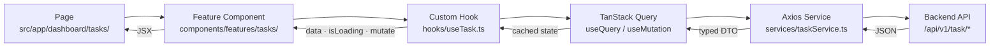
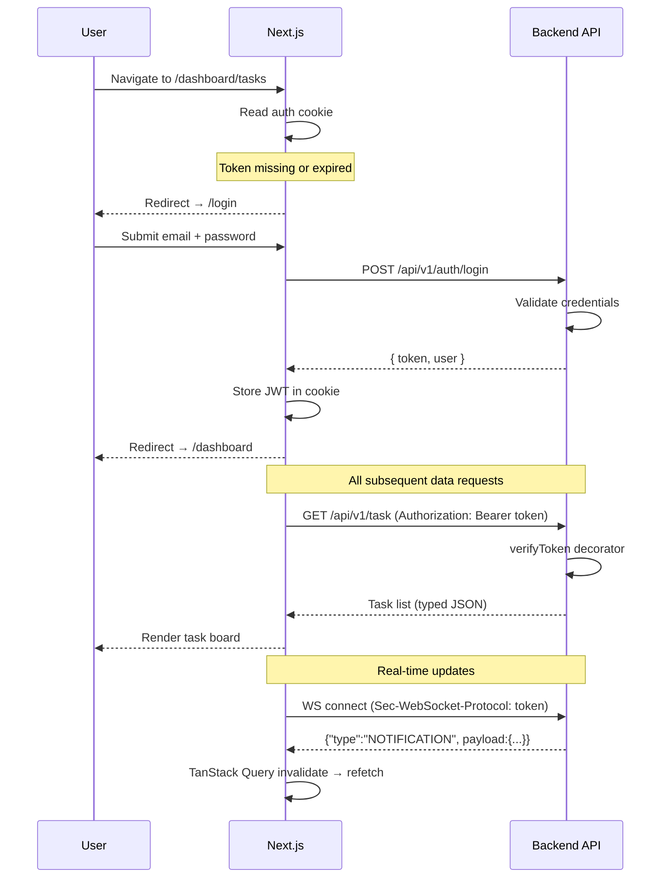

# AlsoNotify — Frontend


The production web application for AlsoNotify — a B2B SaaS project management and team notification platform. Built on **Next.js 16 App Router**, **React 19**, and **Ant Design v6**, with a feature-rich dashboard spanning 15+ modules including task tracking, calendar, leave management, finance, AI assistant, and real-time notifications.

---

## Table of Contents

- [Architecture Overview](#architecture-overview)
- [Tech Stack](#tech-stack)
- [Project Structure](#project-structure)
- [Dashboard Modules](#dashboard-modules)
- [Custom Hooks](#custom-hooks)
- [Design System](#design-system)
- [Getting Started](#getting-started)
- [Environment Variables](#environment-variables)
- [Scripts](#scripts)
- [Testing](#testing)
- [Security](#security)
- [Contributing](#contributing)

---

## Architecture Overview

The frontend follows a **feature-based component architecture** with clear boundaries between routing (pages), domain components, shared UI, and data-fetching logic.

```mermaid
flowchart TD
    B([Browser]) --> NR[Next.js App Router\nsrc/app/**\nServer Components by default]

    subgraph Guard ["Route Guard"]
        NR --> AC{Auth\ncookie?}
        AC -->|missing| LP[/login]
        AC -->|present| DB[/dashboard/*]
    end

    subgraph UI ["UI Layer"]
        DB  --> FC[Feature Components\nsrc/components/features/]
        FC  --> SU[Shared UI\ncomponents/ui + modals]
        FC  --> ANT[Ant Design v6\nrobust component behaviour]
        SU  --> ANT
        ANT --> CSS[globals.css\nAntD overrides · Tailwind v4]
    end

    subgraph Data ["Data Layer"]
        FC  --> CH[Custom Hooks\nsrc/hooks/use*.ts]
        CH  --> TQ[TanStack Query v5\nuseQuery · useMutation · cache]
        CH  --> RC[React Context\nAuth · client-only state]
        TQ  --> AX[Axios Services\nsrc/services/]
    end

    AX  --> API[AlsoNotify API\nlocalhost:4000/api/v1]
    CH  --> WSH[useWebSocket]
    WSH --> WS[WebSocket\nws://localhost:4000/ws]
    WS  --> API
```

### Data Flow Contract

- All **server state** goes through TanStack Query (`useQuery` / `useMutation`). Never fetch directly in components with `useEffect`.
- All **business logic** lives in custom hooks in `src/hooks/`, not in components.
- **Types in `src/types/`** must stay in sync with backend response shapes. Any backend schema change requires a frontend type update.



### Authentication & Route Flow



---

## Tech Stack

| Concern            | Technology                     | Version    |
| ------------------ | ------------------------------ | ---------- |
| Framework          | Next.js (App Router)           | 16.1.6     |
| Language           | TypeScript                     | 5.9.3      |
| UI / React         | React                          | 19.x       |
| Component Library  | Ant Design                     | v6         |
| Styling            | Tailwind CSS                   | v4.1.18    |
| Server State       | TanStack Query                 | v5         |
| Client State       | React Context                  | —          |
| Forms / Validation | Zod                            | v4         |
| HTTP Client        | Axios                          | 1.x        |
| Calendar           | FullCalendar (daygrid, timegrid, interaction) | v6 |
| Charts             | Recharts                       | 3.6.0      |
| Animations         | Framer Motion                  | v12        |
| Toasts             | Sonner                         | 2.x        |
| Icons              | Lucide React + Fluent UI Icons | —          |
| PDF Export         | jsPDF + html2canvas            | —          |
| Markdown           | react-markdown + remark-gfm    | —          |
| Font               | Manrope (Google Fonts)         | —          |
| Error Tracking     | Sentry                         | 10.x       |
| Analytics          | Vercel Analytics + Speed Insights | —       |
| CAPTCHA            | Cloudflare Turnstile            | —          |
| Testing            | Vitest + Testing Library       | 4.0.16     |

---

## Project Structure

```
src/
├── app/                          # Next.js App Router — pages and API routes
│   ├── layout.tsx                # Root layout: fonts, providers, analytics
│   ├── page.tsx                  # Entry redirect
│   ├── login/                    # Authentication
│   ├── register/                 # User registration
│   ├── forgot-password/          # Password recovery
│   ├── password-reset/           # Password reset via token
│   ├── company-details/          # Onboarding — company setup
│   ├── dashboard/                # Protected dashboard shell + nested routes
│   │   ├── tasks/
│   │   ├── requirements/
│   │   ├── calendar/
│   │   ├── leaves/
│   │   ├── employees/
│   │   ├── finance/
│   │   ├── reports/
│   │   ├── workspace/
│   │   ├── notes/
│   │   ├── mail/
│   │   ├── meetings/
│   │   ├── partners/
│   │   ├── feedback/
│   │   ├── profile/
│   │   └── settings/
│   └── api/                      # Next.js API route handlers
│
├── components/
│   ├── common/                   # App-wide shared components (ChatPanel, DocumentsTab)
│   ├── features/                 # Domain components, co-located with their module
│   │   ├── ai/                   # AI assistant chat panel
│   │   ├── auth/                 # Login, register, onboarding forms
│   │   ├── calendar/             # FullCalendar wrappers and event components
│   │   ├── dashboard/            # KPI cards, summary widgets
│   │   ├── employees/            # Team member list, profile cards
│   │   ├── finance/              # Invoice and payment components
│   │   ├── leaves/               # Leave request forms and approval UI
│   │   ├── mail/                 # Inbox, compose, thread viewer
│   │   ├── notes/                # Rich-text note editor and list
│   │   ├── partners/             # Partner management components
│   │   ├── profile/              # User profile editor
│   │   ├── reports/              # Chart wrappers, report filters
│   │   ├── requirements/         # Requirement cards, kanban, activity feed
│   │   ├── settings/             # Workspace and account settings panels
│   │   ├── tasks/                # Task rows, forms, activity log
│   │   └── workspaces/           # Workspace switcher and management
│   ├── layout/                   # Sidebar, Topbar, page shell
│   ├── modals/                   # All Ant Design Modal/Drawer implementations
│   └── ui/                       # Atomic UI primitives (badges, buttons, inputs)
│
├── config/                       # App-level configuration (API base URL, feature flags)
├── constants/                    # Shared enum-like constants
├── context/                      # React Context providers (Auth, Timer, etc.)
├── data/                         # Static data (country lists, role definitions)
├── hooks/                        # 29 custom hooks — all server state and business logic
├── lib/
│   ├── validators/               # Zod schemas for form validation
│   └── workflow/                 # Workflow state machine helpers
├── services/                     # Axios API service functions, one per module
├── styles/
│   └── globals.css               # Global styles + Tailwind base + AntD overrides
├── tests/                        # Integration and unit tests
├── types/
│   └── dto/                      # TypeScript interfaces matching backend response shapes
└── utils/
    ├── date/                     # Date formatting and timezone helpers
    ├── format/                   # Number, currency, string formatters
    ├── mappers/                  # API response → UI model transformers
    ├── navigation/               # Route helpers
    └── security/                 # Token handling, sanitization
```

---

## Dashboard Modules

The dashboard (`/dashboard`) is a protected shell with 15 nested feature modules:

| Route                       | Module            | Description                                              |
| --------------------------- | ----------------- | -------------------------------------------------------- |
| `/dashboard/tasks`          | Task Management   | Create, assign, track tasks with members and deadlines   |
| `/dashboard/requirements`   | Requirements      | Workspace requirements with activity tracking and kanban |
| `/dashboard/calendar`       | Calendar          | FullCalendar with event creation and iCal support        |
| `/dashboard/leaves`         | Leave Management  | Leave requests, approval flows, balance tracking         |
| `/dashboard/employees`      | Employees         | Team directory, profiles, and document management        |
| `/dashboard/finance`        | Finance           | Invoice generation (PDF), payment tracking               |
| `/dashboard/reports`        | Reports           | Analytics charts powered by Recharts                     |
| `/dashboard/workspace`      | Workspace         | Multi-workspace management and settings                  |
| `/dashboard/notes`          | Notes             | Personal and shared rich-text notes                      |
| `/dashboard/mail`           | Mail              | Email inbox integrated with Microsoft Graph              |
| `/dashboard/meetings`       | Meetings          | Meeting scheduling with attendee management              |
| `/dashboard/partners`       | Partners          | Partner company management                               |
| `/dashboard/feedback`       | Feedback          | User feedback submission and upvoting                    |
| `/dashboard/profile`        | Profile           | User profile, avatar, working hours, preferences         |
| `/dashboard/settings`       | Settings          | Workspace settings, integrations, notification prefs     |

---

## Custom Hooks

All 29 custom hooks live in `src/hooks/`. Each hook encapsulates TanStack Query calls and related business logic for a specific domain. Components consume hooks — they do not call services directly.

| Hook                        | Domain                                   |
| --------------------------- | ---------------------------------------- |
| `useAuth`                   | Login, logout, session management        |
| `useCurrentUser`            | Authenticated user data                  |
| `useUser`                   | User CRUD and search                     |
| `useWorkspace`              | Workspace switching and management       |
| `useTask`                   | Task CRUD, assignments, status updates   |
| `useTaskActivity`           | Task activity feed                       |
| `useRequirement`            | Requirement CRUD and kanban              |
| `useRequirementActivity`    | Requirement activity feed                |
| `useLeave`                  | Leave requests and approvals             |
| `useCalendar`               | Calendar events and iCal integration     |
| `useHoliday`                | Public holiday data by country           |
| `useNotification`           | Real-time notification state             |
| `useWebSocket`              | WebSocket connection lifecycle           |
| `useMail`                   | Email inbox and compose                  |
| `useMeeting`                | Meeting scheduling                       |
| `useNotes`                  | Note CRUD                                |
| `useInvoice`                | Invoice generation and management        |
| `useInvoicePresets`         | Invoice template presets                 |
| `useFeedback`               | Feedback submission and voting           |
| `useCompanyDetails`         | Company onboarding and settings          |
| `useDocumentSettings`       | Employee document configuration          |
| `useProfileCompletion`      | Profile completeness score               |
| `useTabSync`                | Cross-tab state synchronization          |
| `useTimezone`               | Timezone detection and conversion        |
| `useBreakpoint`             | Responsive breakpoint detection          |
| `useResizable`              | Resizable panel state                    |
| `useDebounce`               | Input debounce utility                   |

---

## Design System

The app uses a hybrid UI approach: **Ant Design** for component behavior, **Tailwind CSS** for layout, and a global CSS override layer for visual consistency.

### Typography & Colors

- **Font**: Manrope (300–800 weight), loaded via `next/font/google`
- **Primary text**: `#111111`
- **Secondary text**: `#666666`
- No other text colors — two colors only

### Component Anatomy (e.g., table rows)

```
Row container:   px-4 py-2  rounded-[16px]  border-[#EEEEEE]
Primary title:   font-bold   text-[#111111]  text-sm   (task-row-main)
Body values:     font-medium text-[#111111]  text-sm   (task-row-main)
Meta/subtitle:   font-medium text-[#666666]  text-xs   (task-row-sub)
Table headers:   text-xs  font-semibold  uppercase  tracking-wider  text-[#666666]
```

Reference implementation: `src/components/features/tasks/rows/TaskRow.tsx`

### CSS Architecture

`src/styles/globals.css` is the single source of styling truth. It:
- Defines Tailwind base layer and CSS custom properties
- Overrides Ant Design class names (`.ant-picker`, `.ant-select`, `.ant-modal`, etc.)
- Applies custom border-radius, shadows, and color variables globally
- Defines utility classes like `task-row-main` and `task-row-sub`

> **Important**: Before modifying any component's visual appearance, check `globals.css` — many styles are applied globally through AntD class overrides, not inline.

---

## Getting Started

### Prerequisites

- **Node.js** v18+
- **pnpm** v8+ (this project uses pnpm exclusively — do not use npm or yarn)
- AlsoNotify Backend running on port 4000

### Installation

```bash
# 1. Clone the repository
git clone <repository-url>
cd alsonotify-frontend

# 2. Install dependencies
pnpm install

# 3. Configure environment
cp .env.local.example .env.local
# Edit .env.local with your values

# 4. Start the development server (Turbopack enabled)
pnpm dev
```

The app starts on `http://localhost:3000`.

---

## Environment Variables

Create `.env.local` at the project root:

```env
# ── API ───────────────────────────────────────────────────────
NEXT_PUBLIC_API_URL=http://localhost:4000

# ── Developer Tools ────────────────────────────────────────────
# Comma-separated email addresses with access to dev/debug UI
NEXT_PUBLIC_DEVELOPER_EMAILS=dev@example.com

# ── Cloudflare Turnstile (CAPTCHA) ────────────────────────────
NEXT_PUBLIC_TURNSTILE_SITE_KEY=

# ── Sentry ────────────────────────────────────────────────────
NEXT_PUBLIC_SENTRY_DSN=
SENTRY_AUTH_TOKEN=

# ── Vercel (auto-injected in Vercel deployments) ───────────────
# NEXT_PUBLIC_VERCEL_ENV=production
```

---

## Scripts

| Script           | Command                              | Description                                     |
| ---------------- | ------------------------------------ | ----------------------------------------------- |
| `dev`            | `next dev --turbo`                   | Development server with Turbopack                |
| `build`          | `next build`                         | Production build                                |
| `start`          | `next start`                         | Serve production build                          |
| `lint`           | `eslint src`                         | ESLint check                                    |
| `typecheck`      | `tsc --noEmit`                       | TypeScript validation (no emit)                 |
| `test`           | `vitest run`                         | Run full test suite once                        |
| `test:watch`     | `vitest`                             | Test suite in watch mode                        |
| `test:coverage`  | `vitest run --coverage`              | Coverage report                                 |
| `ci`             | `lint && typecheck && test && build` | Full CI validation pipeline                     |

> Run `pnpm run build` after every significant change. The build must pass before any PR is opened.

---

## Testing

Tests use **Vitest** with **jsdom** and **Testing Library**.

```bash
pnpm test           # Run all tests once
pnpm test:watch     # Watch mode during development
pnpm test:coverage  # Generate coverage report
```

**Write tests for:**
- Custom hooks with non-trivial logic
- Utility functions and data transformers
- New features

**Skip tests for:**
- Pure UI/presentational components
- Trivial wrappers or passthroughs
- Refactors (unless specifically requested)

Test files co-located with source: `src/**/*.test.ts` / `src/**/*.test.tsx`

---

## Security

The application ships with hardened HTTP security headers configured in `next.config.mjs`:

| Header                        | Value / Policy                                               |
| ----------------------------- | ------------------------------------------------------------ |
| `Strict-Transport-Security`   | `max-age=63072000; includeSubDomains; preload`               |
| `X-Frame-Options`             | `SAMEORIGIN`                                                 |
| `X-Content-Type-Options`      | `nosniff`                                                    |
| `Referrer-Policy`             | `strict-origin-when-cross-origin`                            |
| `Content-Security-Policy`     | Scoped to Cloudflare, Google Fonts, S3, Sentry, WebSockets   |
| `Permissions-Policy`          | Disables camera, microphone, geolocation, browsing-topics    |

**Console logs** are stripped from production builds by the Next.js compiler (`removeConsole`). Do not rely on this — avoid committing `console.log`.

---

## Contributing

Before opening a PR, the following must pass:

- [ ] `pnpm run build` completes without errors
- [ ] `pnpm run lint` reports no violations
- [ ] `pnpm run typecheck` passes
- [ ] `pnpm test` passes
- [ ] No `any` or `as any` introduced
- [ ] Frontend types updated if backend response shapes changed
- [ ] No dead code; no commented-out blocks
- [ ] New env variables added to `.env.local.example`
- [ ] Components use Tailwind/AntD — no inline styles

**Branch naming:** `feat/short-description`, `fix/short-description`

**Commit format:** `feat: add leave approval notification`

---

*AlsoNotify Engineering*
